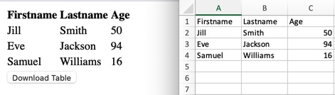

# table-export-example

### Running the Example

To run the example, download the repository and open [index.html](./index.html) in a browser.

### Why?

Ever need to make an Excel file out of an HTML table (without any requests to the backend)? This repository contains an example solution. It uses [TableExport](https://github.com/clarketm/TableExport) (thanks [clarketm](https://github.com/clarketm), Go [Hokies](https://vt.edu/)!), [FileSaver.js](https://github.com/eligrey/FileSaver.js/), and [SheetJS](https://github.com/SheetJS/sheetjs) to convert the HTML table to an Excel file you can download.

### Note

This example showcases using an *existing* button for the download, rather than using generated buttons. These [docs](https://github.com/clarketm/TableExport#export2file) didn't work for me, so in [my.js](./my.js) I needed to add code to get the property name by hand. (I was getting the error `exportData.table is undefined`, if anyone knows what I did wrong let me know!) I was then able to use that with an existing button rather than the generated ones (which also work fine).